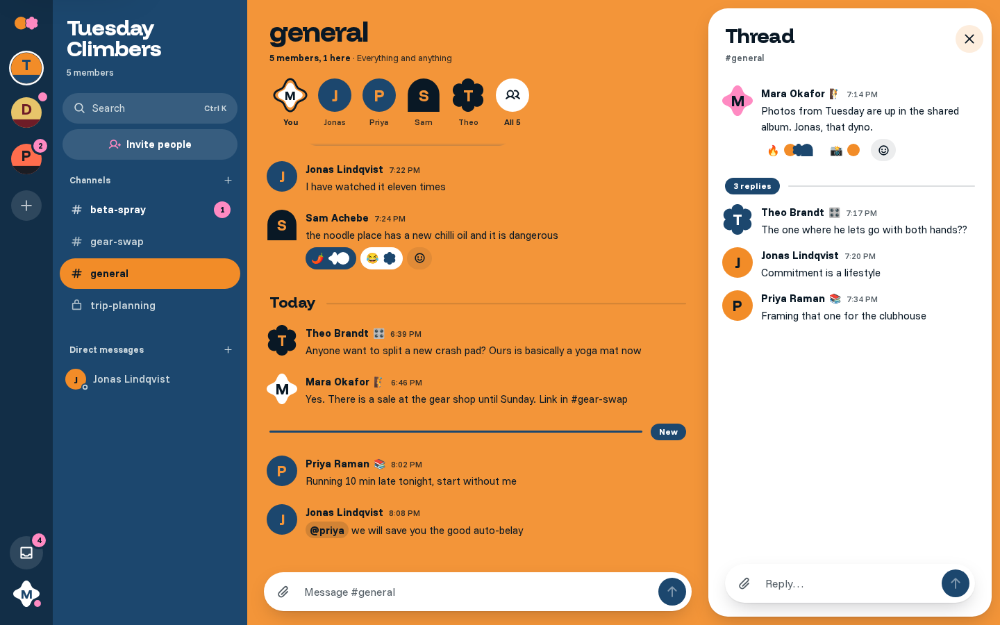
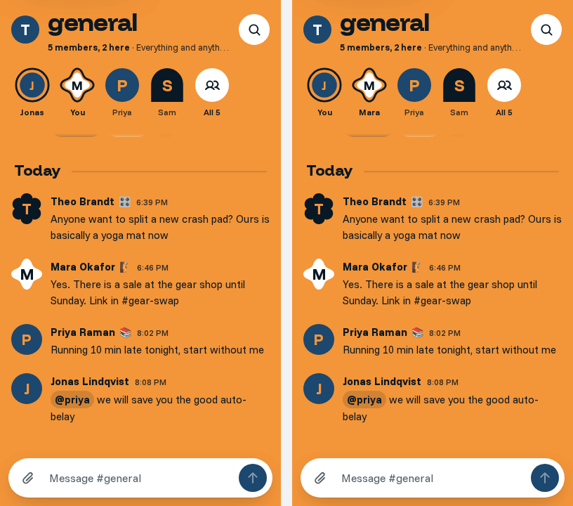
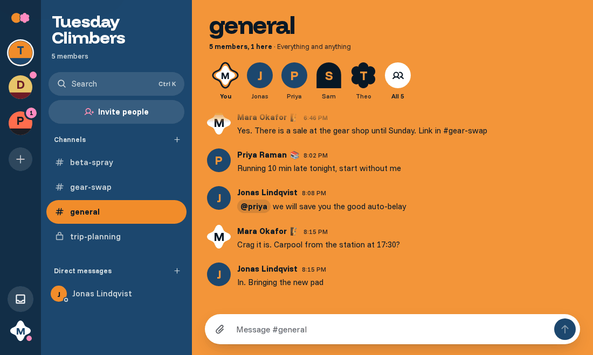
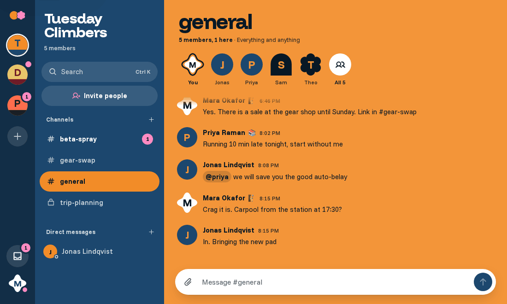
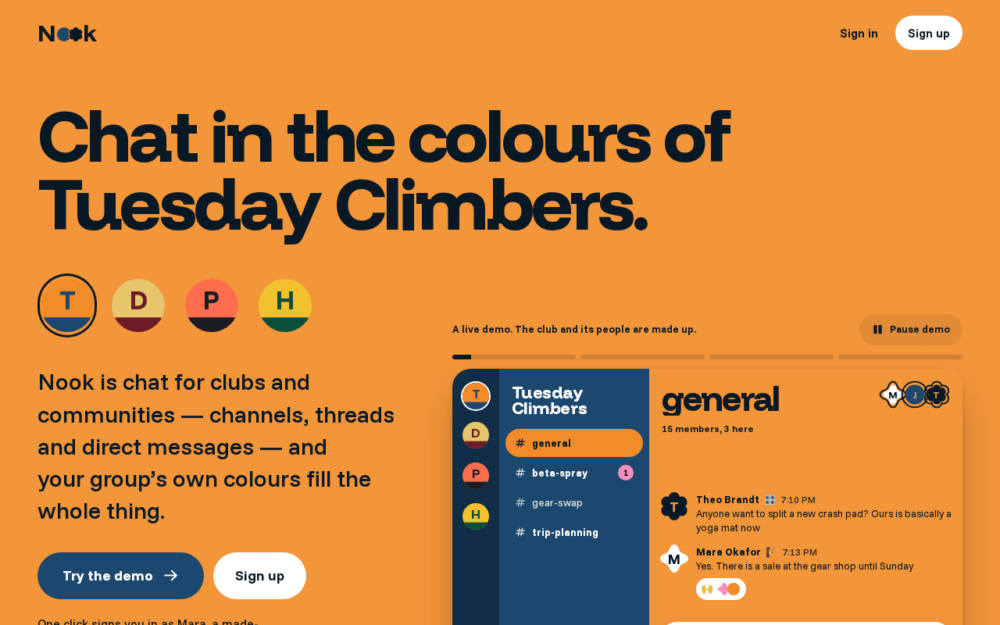
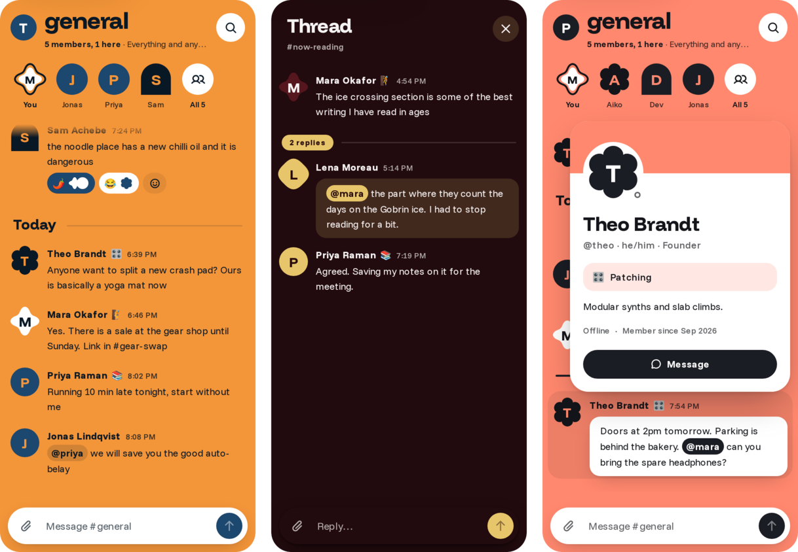

# Nook

A chat app for communities and clubs, in each club's own colours.

<picture>
  <source media="(prefers-color-scheme: dark)" srcset="docs/media/shell-dark.png">
  
</picture>

Channels, threads, DMs, reactions, uploads, mentions, search and presence, for a climbing club or a book club rather than an office. Each community picks two colours, a *field* and a *mark*, and the whole app wears them: the darker one fills the side of the screen, the brighter one fills the room the conversation happens in.

It is also a full-stack portfolio piece: a NestJS modular monolith running as two replicas behind nginx, Socket.IO over a Redis adapter, a BullMQ worker, Postgres full-text search, direct-to-S3 uploads, and custom JWT auth with rotating refresh tokens. The sections below say what each piece does and why it was built that way.

## Run it

Requires Docker.

```bash
docker compose up -d --build
open http://localhost:8080
```

That one command brings up nine containers: Postgres, Redis, SeaweedFS (S3), a one-shot migrate + demo seed, **two API replicas** behind nginx, a BullMQ worker, and the Next.js web app. Once `migrate` has exited and the rest are healthy, the app is on `:8080`.

On the landing page, **Try the demo** signs you in with one click as Mara, a fictional member of three seeded nooks, each in its own kit. You can also sign in as **mara@nook.demo** / **nook-demo-2026**; every seeded member has the same password, so a second browser signed in as **jonas@nook.demo** shows the realtime side.

**The demo seed** is eight made-up people in three nooks: Tuesday Climbers (a climbing club), Dog-Eared (a book club) and Patch Bay (a synth meetup). Between them they have public and private channels, DMs, threads, reactions, custom statuses, and a few unread messages and @mentions waiting for Mara, so the unread weights and the inbox have something to show. The seed is idempotent and its timestamps are relative to when it runs, so a fresh stack always reads as recent.

The one-click demo is on because `docker-compose.yml` sets `DEMO_LOGIN=true`; the api's default is off. Leave it off anywhere real people sign up. Set `NEXT_PUBLIC_REPO_URL` at build time to show a link to the code on the landing page. `/status` shows which api replica answered and whether its database and Redis are up.

## See it move

**Live on every screen.** Mara types, Jonas sees her typing, the message lands on both, and his reply comes straight back. The two browsers can be served by different api replicas: the Redis adapter carries the events between them.



**The pour.** Switching nooks pours the new club's colour over the screen: a wave of liquid paint comes down from the top-left corner, drips swelling and hanging off its front and letting drops fall, and the new room, already in its own colours, fills in behind it. The paint is a WebGL shader drawn in a worker, beside a clip the browser animates on its own, so it keeps its pace while the new room is being drawn. The nook you point at is loaded before you click, so the paint runs over a room that is already drawn; under reduced motion it is a plain cut. (The recording below predates the pour.)



**Cmd/Ctrl+K.** A few letters find channels, people and messages. Picking an old message opens its channel at that message and flashes it, loading older history first if it has to.



**The landing page** is a live nook running a scripted conversation, built from the app's own components. The club discs under the headline pour each club over the whole first screen, and the crowd along its foot is a pile of real bodies (Box2D): heaped differently on every visit, flinching as the cursor brushes past, thrown about by a fast swipe or a tap, staying wherever they land. (The recording below predates the pour and the crowd.)



**On a phone** the rail and channel list tuck into a drawer; the room keeps its colour, its huge channel name and a row of whoever is around. Threads open as a drawer; names open a person card.



## Architecture

<picture>
  <source media="(prefers-color-scheme: dark)" srcset="docs/media/architecture-dark.png">
  
</picture>

**Why a modular monolith, not microservices.** One team and one domain: splitting auth, messages and presence into services would add network hops, distributed transactions and deploy choreography, and buy nothing a club chat needs. The api is one NestJS app with a module per area (auth, nooks, messages, presence, uploads, search, notifications, users), sharing one database and one set of Zod contracts with the web app. Scale is shown sideways instead:

- **Two identical replicas** behind nginx, round-robin, websocket-only (so no sticky sessions). Any request and any socket can land on either one.
- **Redis holds everything the replicas share:** the Socket.IO adapter (an event emitted on api-1 reaches sockets on api-2), presence leases, rate-limit windows and the BullMQ queues.
- **Slow work leaves the request path.** The worker is the same codebase with its own entrypoint: thumbnails, link previews and cleanup run there, and it pushes results to browsers through the same Redis rooms without being a socket server itself.
- **File bytes never touch the api.** The browser uploads to S3 on a presigned URL and fetches through hour-stable signed links.

The e2e suite boots two api instances in one test and proves a message sent to one arrives through the other; the stack check recreates the replicas without restarting nginx and proves both still answer.

## Auth

Custom JWT, no auth library:

- **Access token:** 15-minute HS256 JWT, held in memory in the browser (never in storage).
- **Refresh token:** random 256-bit value in an `httpOnly`, `SameSite=Lax` cookie scoped to `/api/auth`, stored hashed. Single-use: every refresh rotates it.
- **Reuse detection:** presenting an already-rotated token revokes its whole family, so a stolen token dies the moment either party uses it again. A conditional update makes concurrent refreshes safe, and the browser serialises refreshes across tabs with the Web Locks API.
- **Passwords:** argon2id. Unknown emails are checked against a dummy hash so response time doesn't reveal which accounts exist.
- **Rate limits:** Redis fixed windows shared by both API replicas (login: 10/min per IP + email).
- **Lost responses:** a rotated token presented again within 30 s, whose replacement was never used, is treated as a refresh whose response never arrived (tab navigated mid-request), not as theft.

## Realtime

- **Socket.IO, websocket-only, over a Redis adapter.** Two api replicas run behind nginx; an event emitted on either reaches sockets on both. Websocket-only means no long-polling, so nginx needs no sticky sessions. The e2e suite boots two api instances in one test and proves a message sent to one arrives through the other.
- **Handshake auth.** Each connection presents the in-memory access token; an expired one triggers a silent refresh and reconnect.
- **Rooms** per user, channel and nook. When someone gains access to a channel (join, new channel, DM), their live sockets on every replica are subscribed server-side.
- **Idempotent, optimistic sends.** The client shows the message immediately with a `clientId`; the server's unique `(authorId, clientId)` makes retries and reconnect flushes land exactly once, and the saved message replaces the optimistic row in place. Failed sends stay visible with Retry and Discard.
- **History** pages backwards by UUIDv7 id (time-ordered), rendered in a virtualized list that keeps your place while older pages load above.
- **Offline** is detected from the browser's own online/offline events, not just socket timeouts, so the reconnecting notice appears immediately.
- **Redeploy-safe proxying.** nginx re-resolves the replicas through Docker DNS instead of pinning the addresses it saw at startup; a redeploy reshuffles container addresses, and pinned upstreams silently drop a replica. The stack check recreates the app containers without restarting nginx to prove it.
- **Ready, not just connected.** A socket's `connect` fires before the server has joined its rooms; the server sends `session:ready` once it has, and clients treat that as connected, so nothing emitted in between is lost.

## Presence and typing

- **Leases in Redis.** Each socket holds a 60 s lease in a sorted set, renewed every 20 s by the replica that owns it. A tab closing removes its lease; a replica dying lets its leases lapse, and a sweeper on the surviving replicas announces those people offline.
- **One atomic decision.** A Lua script drops expired leases, derives the state (offline, do-not-disturb, away when every tab is idle or you chose it, otherwise on now) and swaps it with the last announced one. Only a real change is broadcast, and two replicas can never announce out of order.
- **Four shapes, not four colours:** filled disc (on now), half disc (away), bar (do not disturb), ring (offline), plus the words in the member sheet.
- **Typing** is throttled on both ends and relayed only within the channel's room, so outsiders never see it and senders never get their own echo.

## Threads and reactions

- **One level of threads.** A reply names its root; the server refuses replies to replies, to other channels' messages and to deleted ones. The reply and the root's count, last-reply time and recent repliers change in one transaction, and the updated root is broadcast so every summary moves live. Replies never enter the channel's own history.
- **Linkable threads.** The open thread lives in the URL (`?thread=`), beside the channel on wide screens and in a drawer on small ones.
- **Reactions** are idempotent PUT/DELETE toggles, validated as a single pictographic grapheme (so skin tones, ZWJ sequences and flags pass; text and markup don't). Pills carry the shapes of who reacted and name them for assistive tech; yours is filled in the club's other colour and set bold, so it reads without colour too.
- **Batched reads.** Every page of messages loads its reactions and recent repliers in two queries, not one per message.

## Uploads and link previews

- **Direct to storage.** The api validates type and size, reserves an attachment and returns a presigned PUT that only accepts that exact type and length; the browser uploads straight to S3 (SeaweedFS) with real progress. The api never streams file bytes. Completion is confirmed against the object's actual size.
- **Private bucket, cacheable links.** Files are served through presigned GETs signed as of the start of the hour: the same URL for an hour, so browsers cache it, and never less than an hour of validity left.
- **Worker thumbnails.** Images go on the BullMQ queue; the worker reads real dimensions (EXIF rotation included) with sharp and writes a WebP thumbnail. Images render at their true proportions with space reserved before they load, so nothing shifts. A message's pictures open full size as one set, in the order they were attached, stepped through with arrows, the arrow keys or a swipe.
- **Worker → sockets via Redis.** The worker isn't a socket server; it pushes updates into the same rooms through `@socket.io/redis-emitter`.
- **SSRF-safe unfurling.** Only http(s) on 80/443; IP-literal hosts checked directly (Node never calls DNS for them, e.g. `169.254.169.254`); every hostname resolved inside the connection with private, loopback, link-local and CGNAT ranges refused, so there's no DNS-rebinding window; redirects followed by hand and re-checked; 5 s timeout, 1 MB cap, HTML only. Preview images are https-only and loaded without a referrer.
- **Housekeeping.** A repeating job deletes uploads that were never sent.

## Mentions, unread and notifications

- **Mentions are resolved by the server.** `@handle` is parsed on send and on edit (never inside code, never an email address), and only people who can read the channel count, so a mention can't leak a private channel. Mentions and notifications are written in the same transaction as the message; an edit that drops a mention takes its notification back, and a deleted message leaves every inbox.
- **Notifications** go to whoever is mentioned, and a thread reply notifies the root's author and earlier repliers (a mention wins over a reply, one notification per person per message). They arrive live on the recipient's own socket room, from any replica.
- **Unread from one pointer.** Each channel membership stores the last read message id. Since ids are UUIDv7, "unread" is simply "id greater than the pointer", counted in one query for every channel (capped at 1,000). The pointer only moves forward, and only to a message in that channel. Reading a channel past a mention also clears that mention's notification.
- **Server truth, no drift.** The client never does unread arithmetic: activity triggers a debounced refetch, and activity where you are already reading (the channel scrolled to the bottom of a visible tab, or an open thread) is marked read instead of counted. Other tabs hear `unread:changed` and catch up.
- **Seen in the shell.** A channel with something new turns its name bold and full white; mentions (and every unread DM) get a count in the nook's pop colour, a "New" line marks where you left off, and the inbox on the rail collects mentions and replies from every nook. Another nook with news carries a dot, or a count when something is for you, on its disc.

## Search and Cmd+K

- **Postgres full-text, no extra service.** `Message.search` is a generated `tsvector` column with a GIN index, so Postgres keeps it current on every insert and edit. Deleted messages are blanked and filtered out.
- **Search as you type.** Every word matches as a prefix (`clim` finds "climbing"); `in:#channel`, `from:@name` and `-word` narrow it down. Typed text is reduced to letters, digits and underscores before it becomes a `tsquery`, so nothing typed can act as query syntax. Only channels you're a member of are searched, newest first, a page at a time.
- **One palette for everything.** Cmd/Ctrl+K jumps to channels, DMs and other nooks, messages people, sets your status, and previews message hits; "See all results" opens a results column beside the conversation (a drawer on small screens). It's a real combobox: arrows, Enter, Escape, and screen readers hear the options and counts.
- **Jump to any message.** Picking a result opens the channel at that message and flashes it, paging back through history until it's loaded, however old.

## Profiles

- **Your member card.** Name, pronouns, bio and a custom status (emoji, text, and "clear after" 1 hour, 4 hours or today). The editor previews the card others will see as you type. Hover, click or press Enter on anyone's name, their row in the member sheet, a DM header or an @mention to see their card, with a Message button (or Edit profile, on your own).
- **Pick your shape.** No photo, or a photo you want cut differently? Choose one of twenty-one shapes and one of three colours in Edit profile, and watch the preview morph into it. The colours are slots, not hexes: every nook paints them from its own kit, so you look like yourself in every club without clashing with one. Until you pick, your handle gives you one of the original eight, the same as it always did. The api stores the choice by name and refuses one it doesn't know.
- **Statuses expire on their own.** The server stores the expiry and stops reporting a lapsed status; clients also hide it the moment it passes, with no job needed to clear it.
- **Avatars.** The browser uploads the original straight to storage; the api decodes it (anything that isn't really an image is refused, and so are decompression bombs), crops a 256×256 square around the most interesting region, stores a WebP, and deletes the previous one. Avatars are served from a stable `/api/users/:id/avatar?v=…` address that redirects to an hour-stable signed URL, so `` tags work without a token and a new photo is a new URL. Uploads that are never completed are swept by the hourly cleanup job.
- **Live everywhere.** A profile change goes out as `user:updated` to the rooms of every nook you're in (and nobody else), and every cached copy of you in the client is patched.

## Design

The visual system is documented in [DESIGN.md](DESIGN.md). Nook is designed like a story you tap through: a club's colours don't accent the app, they are the app. A nook's darker colour fills the rail and the channel list; its brighter colour fills the room, where the channel's name is set at poster size in Funnel Display and the talk sits straight on the colour. Cards — white by day, a near-black of the club's hue by night — are kept for what is lifted off the colour: the composer, popovers and dialogs, and any message that mentions you. Each nook also gets one loud extra colour, picked from a short list of candy colours as the one furthest in hue from both of its own, for counts, rings and invites. People are bold flat shapes — a circle, a flower, a sparkle, an arch, and seventeen more — with their initial inside, picked from their handle until they choose their own, and whoever is around wears a ring in their own outline, in a strip across the top of the room. By night the room takes the club's darker colour, still saturated, and the poster type takes the bright one. Everything else is set in Funnel Sans.

- **Any two colours, always readable.** Every surface's colours are computed from whatever a founder picked, then walked apart until every pair that carries text clears its bar (body text 6.5:1, secondary text 4.5:1, highlight shapes 3:1); a check sweeps the presets, a 24-hue wheel and degenerate kits (all black, all white, grey, neon) in both schemes, against every surface with the hover wash on.
- **Flat, on purpose.** No gradients, glass, grain or glow: depth is colour against colour, and only things floating over the room cast a shadow. Things arriving land with a small overshoot, once; everything else eases out.
- **States that keep their shape.** Loading shows the shell in the nook's own colours, with the channel list and messages as quiet static placeholders; the start of a channel shows its people at poster size; not-found and error pages keep the house colours and a way back.
- **Accessibility is tested, not assumed.** axe runs in the browser suite over sign-in, sign-up, join, the shell, threads, the palette, the inbox, person cards and the profile dialog, in light and dark, and fails on any serious or critical WCAG 2.2 AA issue. There's a skip link to the conversation, presence is shown by shape as well as colour (a disc, a half disc, a bar, an open ring), and popups drop their movement (but keep their fade) under reduced motion.
- **Reviewed.** The finished UI went through Impeccable's finish review against its written direction.

## Nooks, channels, invites

- A **nook** is a community with its own **kit** (two colours). The whole screen takes the current nook's kit; every colour is derived from the kit with WCAG contrast maths shared by web and api.
- **Channels** are public (everyone in the nook) or private (hand-picked). **DMs** are one channel per pair, created on first use; a unique key makes simultaneous "open DM" requests converge on one channel.
- **Invite links** can expire and cap their uses. The cap is enforced by a single conditional `UPDATE … RETURNING`, so a link for N people admits exactly N even under concurrent clicks. Non-members get 404s, so a nook's existence doesn't leak.

## Develop

Requires Node 24 and pnpm 11.

```bash
pnpm install
cp apps/api/.env.example apps/api/.env
docker compose up -d postgres redis storage
pnpm db:migrate && pnpm db:seed
pnpm dev            # web on :3000, api on :4000
pnpm typecheck && pnpm lint
pnpm exec playwright test      # browser tests against the docker stack on :8080
```

### How it's checked

Each build phase was finished against a set of runnable checks. The main ones:

- `node scripts/verify-<area>-api.mjs`: the api's unit and e2e suites (Vitest, against a real Postgres and Redis), which must include the tests named for that area.
- `node scripts/verify-auth-web.mjs`: rebuilds the docker stack and runs the Playwright browser suite through nginx.
- `node scripts/verify-a11y.mjs`: axe over every screen, in light and dark, failing on any serious or critical WCAG 2.2 AA issue.
- `node scripts/verify-fresh-clone.mjs`: clones HEAD, runs the one command above as its own compose project, and checks the result.

### Regenerating the screenshots

Everything in `docs/media/` comes from `scripts/readme-media.mjs`, driven by Playwright against a freshly seeded stack. GIFs are built from Chrome's own screencast frames and assembled with ffmpeg; the phone strip needs ImageMagick. The architecture diagram is rendered from [docs/diagram/architecture.html](docs/diagram/architecture.html).

```bash
node scripts/fresh-stack.mjs up      # stops the main stack, starts a clean clone of HEAD as "nook-fresh"
node scripts/readme-media.mjs        # writes docs/media/
node scripts/fresh-stack.mjs down    # removes the clone and its volumes, starts the main stack again
```


## Layout

| Path | What |
|---|---|
| `apps/web` | Next.js 16 (App Router), Tailwind v4, Base UI |
| `apps/api` | NestJS 12 modular monolith + worker entrypoint, Prisma 7 |
| `packages/contracts` | Zod schemas shared by web and api (REST + socket events) |
| `packages/config` | Shared TypeScript config |
| `infra/` | nginx and storage config |
| `e2e/` | Playwright browser tests |
| `scripts/` | verification checks, the fresh-clone check and the README media generator |
| `docs/` | README media and the diagram source |
